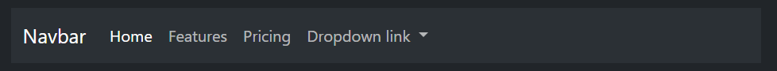
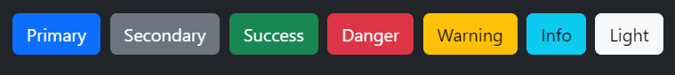
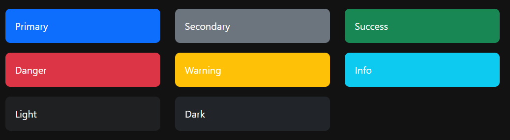
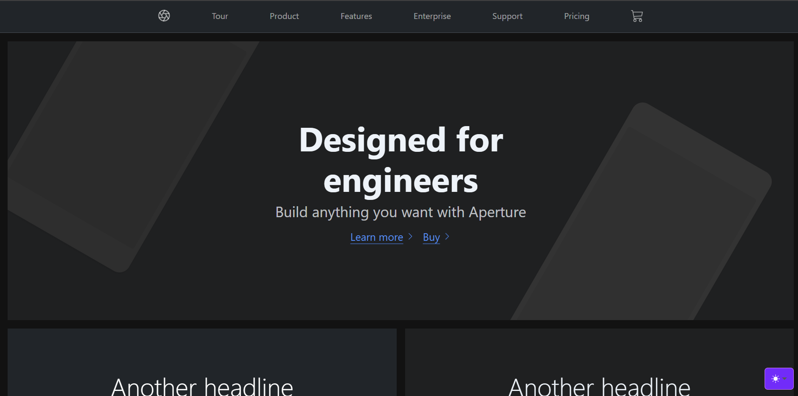
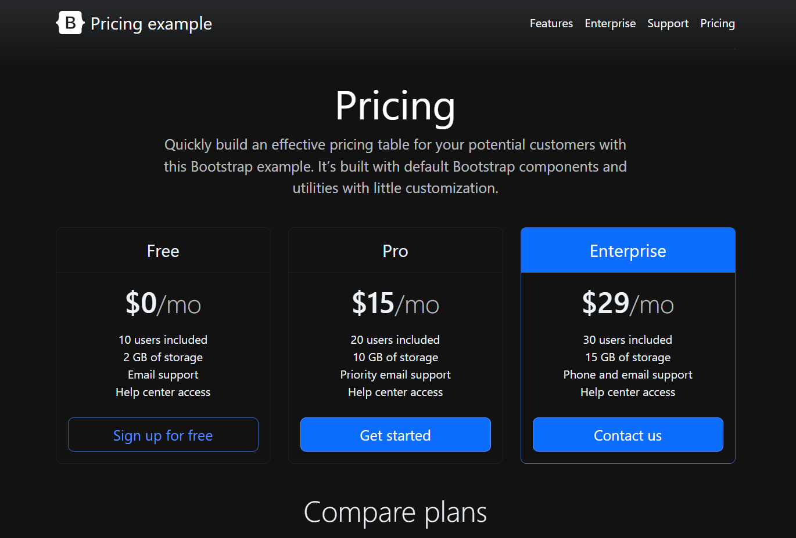

<!-- .slide: data-background="assets/bg.png" -->

# Bootstrap 5
## HTML/CSS/JS
### 1IMB - Uke 41

---

## Get Bootstrap


[GetBootstrap.com](https://getbootstrap.com)


Currently v5.3.2 · ***Download*** · All releases


---

### Lage ny nettside med bootstrap

- Starte ett nytt prosjekt med bootstrap
  - Hjemstedet ditt
  - Valgfri bedrift
  - Ny porteføljeside
  - Egne forslag

---

## Kopiere Bootstrap CSS

1. Pakk ut `bootstrap-5.3.2-dist.zip`
2. Gå inn i mappen
`bootstrap-5.3.2-dist\css`

3. Kopier filen `bootstrap.css`
4. Lim inn i den nye prosjektmappen

---

## Starte med Bootstrap


> *Hint*: VS Code - skriv `!` og trykk `Enter` for standard HTML5 Mal

```html
<!doctype html>
<html lang="en">
  <head>
    <meta charset="utf-8">
    <meta name="viewport" content="width=device-width,
     initial-scale=1">
    <title>Bootstrap</title>  
    <link href="bootstrap.css" rel="stylesheet">
  </head>
  <body>
    <h1>Hello, world!</h1>
  </body>
</html>
```

---

## Bruke Bootstrap komponenter

Eksempler på kompoenter






---

## Lek & Lær

Se eksempler og les dokumentasjon på

[GetBootstrap.com](https://getbootstrap.com)

----
### Farger


```
<p class="text-warning">Denne teksten blir oransje</p>

<p class="text-center text-success">
  Denne teksten blir grønn og midtstilt
</p>
```
----



----



---

## W3Schools

[w3schools.com/bootstrap5](https://www.w3schools.com/bootstrap5/)