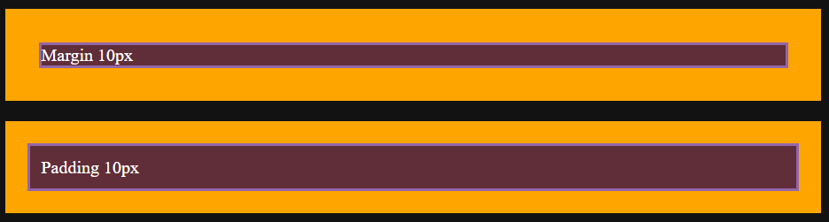
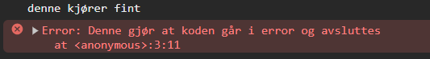
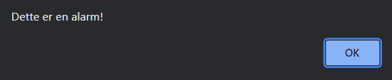

<!-- .slide: data-background="assets/bg.png" -->

# Utvikling
## Back to basics

---

## HTML

```
<!DOCTYPE html>
<html>
    
    <head>
        Metadata
    </head>

    <body>
        Innholdet på nettsiden
    </body>

</html>
```

----

## HTML Head

```
<head>
    <!--- 8-bit Unicode Transformation Format --->
    <meta charset="UTF-8">
    <meta name="viewport" 
        content="width=device-width, initial-scale=1.0">
    <title>Sidetittel</title>
    <link rel="icon" type="image/x-icon" href="favicon.ico">
    <link rel="stylesheet" href="style.css">
</head>
```

----

## HTML Elementer
```
<div></div>
<span></span>

<nav>
    Meny
</nav>
<main>
    <article>
        <header>Artikkel Tittel</header>
        <p>
            Innhold i artikkel
        </p>
    </article>
</main>
```

----

## Tekstmanipulering

HTML
```html
<strong>Fet tekst</strong>
<em>Kursiv tekst</em>
<u>Understreket tekst</u>
<s>Stryket tekst</s>
<mark>Markert tekst</mark>
```

----

## DIV - Division / Seksjon

HTML
```html
<div class="klasse1 klasse2" id="hoveddiv">
    Innhold
</div>
```

CSS
```css
div {
    display: block; /* egen linje, full bredde */
}
```

----

## SPAN - Inline element

HTML
```html
<span class="klasse1 klasse2" id="hovedspan">
    Innhold
</span>
```

CSS
```css
* {
    display: inline; /* inni linje, minimal størrelse */
}
```

----

## MAIN - HTML5
#### Spesifiserer hovedinnholdet for en nettside

HTML
```html
<main>
    Innhold
</main>
```

CSS
```css
main {
    display: block; /* egen linje, full bredde */
}
```

----

## NAV - HTML5
#### Spesifiserer navigasjonsmenyen

HTML
```html
<nav>
    Innhold
</nav>
```

CSS
```css
nav {
    display: block; /* egen linje, full bredde */
}
```

----

## ARTICLE - HTML5
#### Spesifiserer artikkel

HTML
```html
<article>
    Innhold
</article>
```

CSS
```css
article {
    display: block; /* egen linje, full bredde */
}
```

----

## ASIDE - HTML5
#### Spesifiserer sidestilt artikkel

HTML
```html
<aside>
    Innhold
</aside>
```

CSS
```css
aside {
    display: block; /* egen linje, full bredde */
}
```

----

## Punktlister

HTML
```html
<ul>
    <li>Punktliste</li>
    <li>Punktliste</li>
</ul>
```

CSS
```css
ul {
    display: block;
    list-style-type: disc;
    margin-block-start: 1em;
    margin-block-end: 1em;
    margin-inline-start: 0px;
    margin-inline-end: 0px;
    padding-inline-start: 40px;
}
```

----

## Nummererte lister

HTML
```html
<ol>
    <li>Nummerert liste</li>
    <li>Nummerert liste</li>
</ol>
```

CSS
```css
ol {
    display: block;
    list-style-type: decimal;
    margin-block-start: 1em;
    margin-block-end: 1em;
    margin-inline-start: 0px;
    margin-inline-end: 0px;
    padding-inline-start: 40px;
}
```

----

## Tabeller

```html
<table>
    <thead>
        ...
    </thead>
    <tbody>
        ...
    </tbody>
</table>
```

----

## Tabell Overskrifter

```html
<table>
    <thead>
        <tr>
            <th>ID</th>
            <th>Navn</th>
            <th>E-Post</th>
        </tr>
    </thead>
    <tbody>
        ...
    </tbody>
</table>
```

----

## Tabell innhold

```html
<table>
    ...
    <tbody>
        <tr>
            <td>1</td>
            <td>Ola</td>
            <td>ola@nordmann.no</td>
        </tr>
        <tr>
            <td>2</td>
            <td>Kari</td>
            <td>kari@nordmann.no</td>
        </tr>
    </tbody>
</table>
```

----

## Bilder

```html

```

----

## Video - HTML5

```html
<video width="320" height="240" controls>
  <source src="movie.mp4" type="video/mp4">
  <source src="movie.ogg" type="video/ogg">
  Your browser does not support the video tag.
</video>
```

----

## Audio - HTML5

```html
<audio controls>
  <source src="horse.ogg" type="audio/ogg">
  <source src="horse.mp3" type="audio/mpeg">
  Your browser does not support the audio tag.
</audio>
```

----

## GRID - HTML5
#### Lage rutenett for nettside

```html
<div class="min-grid">
    <div>Kolonne 1 Rad 1</div>
    <div>Kolonne 2 Rad 1</div>
    <div>Kolonne 3 Rad 1</div>
    <div>Kolonne 1 Rad 2</div>
    <div>Kolonne 2 Rad 2</div>
    <div>Kolonne 3 Rad 2</div>
</div>
```

```css
.min-grid {
    display: grid;
    grid-template-columns: repeat(3, 1fr);
}
```

----

## FLEX - HTML5
#### Plassering av innhold

```html
<div class="min-flex">
    <div>Element 1</div>
    <div>Element 2</div>
    <div>Element 3</div>
</div>
```

```css
.min-grid {
    display: flex;
    justify-content: center; /* midtstiller elementene */
}
```

----

# Videre til CSS


---

## CSS

```css
* {  /* stjerne betyr alle elementer */
    padding: 0;
    margin: 0;
}
```

----

## CSS for HTML Elementer

```css
body {
    background-color: #000000;
    color: #FFFFFF;
}
```

```html
<body></body>
```

----

## CSS Klasser

```css
.min-klasse {
    background-color: #000000;
    color: #FFFFFF;
}
```

```html
<div class="min-klasse"></div>
```

----

## CSS Klasser 2

```css
.klasse-1 {
    background-color: #000000;
}

.klasse-2 {
    color: #FFFFFF;
}
```

```html
<div class="klasse-1 klasse-2"></div>
```

----

## CSS ID

```css
#minid {
    background-color: #000000;
    color: #FFFFFF;
}
```

```html
<div id="minid"></div>
```

----

## CSS Kombinere ID, klasser og elementer

```css
#minid {
    background-color: #000000;
}

.klasse {
    color: #FFFFFF;
}

div {
    border: 1px solid #000000;
}
```

```html
<div id="minid" class="klasse"></div>
```

----

## CSS Kombinere ID, klasser og elementer

```css
#minid, .klasse, div {
    background-color: #000000;
    color: #FFFFFF;
    border: 1px solid #000000;
}
```

```html
<div></div>
<main id="minid"></main>
<article class="klasse"></article>
```

----

## CSS - Farger & Fargekoder

Heksadesimal - 16-tallssystemet
```text
0 1 2 3 4 5 6 7 8 9 A B C D E F
```

```css
color: blue;
/* Red, Green, Blue - 16-tallssystemet / heksadesimal */
color: #0000FF; /* R, G, B = 0  0  255 = 00 00 FF = 0000FF */
color: rgb(0, 0, 255);
color: rgba(0, 0, 255, 0.5); /* RGB med Alpha/Gjennomsiktighet */
```

----

## CSS - Størrelser

```css
/* Absolutte størrelser */
width: 100px; /* Piksler */
width: 15mm; /* Millimeter (ikke brukt men mulig) */

/* Relative størrelser */
width: 2em; /* em - relativ til tekst-størrelsen. 2em = 2*font */
width: 1.5rem; /* rem - relativ til tekst-størrelse på :root */ 
width: 50vw; /* vw - relativ bredde til viewport/skjermstørrelse, 
                50vw = 50% utifra skjermstørrelse */
width: 50vh; /* vh - relativ høyde til viewport/skjermstørrelse, 
                50vh = 50% utifra skjermstørrelse */
width: 30%; /* Prosent størrelse relativ til forelder,
                altså 30% av bredden til forelder elementet */
```

----

## CSS - Størrelser - Grid

```css
grid-template-columns: 1fr 1fr 1fr 1fr; /* eller bruk repeat */
grid-template-columns: repeat(4, 1fr);
            /* 1fr = 1 frame. Har alle kolonner 1fr 
                vil bredden fordeles likt */

grid-template-columns: 1fr 2fr 0.5fr;
            /* kolonne 1 = 1/3.5
               kolonne 2 = 2/3.5
               kolonne 3 = 0.5/3.5 */
```

----

## CSS - Margin & Padding

```css
.klasse {
    margin: 10px; /* Pusterom utenfor boksen */
    padding: 10px; /* Pusterom innenfor boksen */
}
```



----

# Over til JavaScript


---

## JavaScript

```javascript
let navn = "Thom";

function minFunksjon() {
    return "Hei";
}
```

----

## Variabler i JavaScript

```javascript
/* variabler */
let variabel1 = "Hei";
let variabel2 = 1000;

/* konstanter */
const konstant1 = "Konstant Variabel";
const konstant2 = 1337;

/* varabler uten verdi */
let var1_utenverdi;
let var1_utenverdi, var2_utenverdi, var3_utenverdi;
```

----

## Funksjoner i JavaScript

```javascript
/* "gamlemåten" */
function minFunksjon() {
    return "MinFunksjon";
}

/* "nyemåten" */

let minFunksjon = () => {
    return "MinFunksjon";
}
```

----

## Printe til konsoll i JavaScript

```javascript
console.log("Dette havner i konsoll");

console.log(minFunksjon()); /* Printer 'return' 
                                verdien til konsoll */

console.log("var:", variabel1, "func:", minFunksjon(), "samtidig");

console.debug(''); /* Debugging - for feilsøking */
console.info('');  /* Info - for informasjon */
console.log('');   /* Log - generell logging til konsoll */
console.warn('');  /* Warn - For advarsler */
console.error(''); /* Error - For feilmeldinger */
console.trace(''); /* Trace - For systemfeilmeldinger */
```

----

## Manipulere HTML med JavaScript

```html
<h1 id="overskrift">Før javascript kjører</h1>
```

```javascript
document
    .querySelector("#overskrift")
    .textContent = 'Javascript Tittel';
```
Etter javascript har kjørt
```html
<h1 id="overskrift">Javascript Tittel</h1>
```

----

## Manipulere HTML med JavaScript 2

```html
<h1 id="overskrift">Før javascript kjører</h1>
```

```javascript
document
    .querySelector("#overskrift")
    .innerHTML = 'Java<strong>Script</strong>';
```
Etter javascript har kjørt
```html
<h1 id="overskrift">Java<strong>Script</strong></h1>
```

----

## Manipulere HTML med JavaScript 3

```html
<h1 id="overskrift" style="color: red;">Tekst med rød farge</h1>
```

```javascript
let overskrift = document.querySelector("#overskrift");
overskrift.style.color = 'blue';
overskrift.textContent = 'Tekst med blå farge';
```

Etter javascript har kjørt
```html
<h1 id="overskrift">Tekst med blå farge</h1>
```

----

## Funksjoner med parametere

```javascript
function add(a, b) {
    return a + b;
}

let add = (a, b) => {
    return a + b;
}

console.log("Regn ut 3 + 5 = ", add(3, 5));
```

----

## Feilhåndtering

```javascript
try {
    console.log('denne kjører fint');
    throw Error('Denne gjør at koden går i error og avsluttes');
} catch(error) {
    console.error(error);
}

```


----

## Kjør JS Funksjon når nettside lastet

```javascript

function sendAlarm() {
    alert('Dette er en alarm!');
}

window.onload = function() {
  sendAlarm();
};

```




----

# Videre til JSON


---

## JSON
### JavaScript Object Notation

```json
{
    "navn": "Thom",
    "alder": 33,
    "programmeringsspraak": [
        "python",
        "php",
        "java",
        "c/c++",
        "c#",
        "rust",
        "go",
        "javascript",
        "kotlin"
    ]
}
```

----

## JSON Objekt

```json
{
    "nøkkel": "verdi"
}
```

Eksempel på ett enkelt JSON Objekt

```json
{
    "navn": "Thom",
    "alder": 33,
    "alias": "NorskFjellGeit"
}
```

----

## JSON Objekt med lister

```json
{
    "nøkkel": [
        "element",
        "element",
        "element"
    ]
}
```

Eksempel på ett enkelt JSON Objekt med liste

```json
{
    "spillere": [
        "NorskFjellGeit",
        "The1337Gamer",
        "Kattepewz1",
        "DaInternetz"
    ]
}
```

----

## JSON Objekt med liste over objekter

```json
{
    "server_id": 1,
    "antall_spillere": 2,
    "spillere": [
        {
            "navn": "NorskFjellGeit",
            "score": 131
        },
        {
            "navn": "The1337Gamer",
            "score": 1337
        }
    ]
}
```

----

# Videre til JSON & JavaScript


---

### JSON & JavaScript

```json
<!-- user.json -->
{
    "bruker": "Thom",
    "alder": 33
}
```

```html
    <h1>Navn: <span id="navn">Laster...</span></h1>
    <h1>Alder: <span id="alder">Laster...</span></h1>
    <script type="text/javascript">
      fetch('./user.json').then(res => {
        res.json().then(json => {
          document.querySelector("#navn").textContent = json.bruker;
          document.querySelector("#alder").textContent = json.alder;
        }).catch(error => {
          console.error('Feil i JSON fil', error);
        });
      }).catch((err) => {
        console.error(err);
      });
    </script>
```

----

### Eksterne JSON data i JavaScript

```html
<h1>Temperatur: <span id="temp">Laster...</span></h1>
<script type="text/javascript">
    fetch('https://api.met.no/weatherapi/locationforecast/2.0/'+
            'compact?lat=58.4686933&lon=8.7209715').then(res => {
        res.json().then(json => {
            let tempelem = document.querySelector("#temp");
            tempelem.textContent = json.properties.timeseries[0]
                                .data.instant
                                .details.air_temperature;
        }).catch(error => {
            console.error('Feil i JSON fil', error);
        })
    }).catch((err) => {
        console.error(err);
    });
</script>
```

----

## JSON Oppsumering

```json
{
    "key": "value"
    "element_list": [
        "list element 1", /* index 0 */
        "list element 2", /* index 1 */
        "list element 3"  /* index 2 */
    ]
}
```

```javascript
let jsondata = fetch(...) /* osv...*/

/* variablen key_value vil ha verdien 'value' */
let key_value = jsondata.key;

/* variablen vil ha verdien 'list element 2' 
    fordi vi velger index 1 */
let second_list_element = jsondata.element_list[1]
```

----

# Videre til Python


---

## Python

```python
navn:str = "Thom"

def informasjon():
    return "Navn: " + navn

print(informasjon())
```

----

## Python variabler og typer

```python
streng_variabel:str = "Dette er en streng"
heltall_variabel:int = 1000
desimal_variabel:float = 2.56
boolsk_variabel:bool = True

liste_variabel:list = ["hei", "hallo", "velkommen"]

# Objekter kalles en dictionary i Python, så dict
objekt_variabel:dict = {
    "navn": "Thom",
    "alder": 33
}
```


----

## Python funksjoner

```python
def min_funksjon():
    return "Min Funksjon"

print(min_funksjon())
```

----

## Python funksjoner med parameter

```python
def min_funksjon(navn):
    return "Navnet er " + navn

print(min_funksjon("Thom"))
```

----

## Python funksjoner med parametere

```python
def min_funksjon(navn, alder):
    return "Navn: " + navn + ", Alder: " + str(alder)

print(min_funksjon("Thom", 33))
```

----

## Python typedefinerte funksjoner og parametere

```python
def min_funksjon(navn:str, alder:int) -> str:
    return "Navn: " + navn + ", Alder: " + str(alder)

print(min_funksjon("Thom", 33))
```

----

## Python format string / f-string

```python
navn = "Thom"
alder = 33

formatert_streng = f"Navn: {navn}\nAlder: {alder}"
print(formatert_streng)
```

----

## Python funksjon, typer, f-string & standard verdi

```python
def personalia(navn:str="Ukjent", alder:int=-1) -> str:
    return f"Navn: {navn}\nAlder: {alder}"

print(personalia())

print(personalia(navn="Thom", alder=33))
```

----

## Python if-statements

```python
navn:str = "Geir"

if navn == "Knut":
    print("Velkommen Knut!")
else:
    print("Du er ikke Knut! Ingen Adgang!")

```

----

## Python if-statements 2

```python
score:int = 1337

if score >= 1000:
    print("Ny highscore!")
else:
    print("Ikke ny highscore")

```

----

## Python for-loops

```python
spillere:list = [
    "NorskFjellGeit",
    "1337Gamer",
    "DaKillah"
]

for spiller in spillere:
    print(spiller)

```

----

## Python for-loops 2

```python
spillere:list = [
    "NorskFjellGeit",
    "1337Gamer",
    "DaKillah"
]

for spiller in spillere:
    print(f"Spillernavn: {spiller}")

```

----

## Python Avanserte for-loops
### AKA List Comprehensions
#### For viderekommende

```python
spillere:list = [
    "NorskFjellGeit",
    "1337Gamer",
    "DaKillah"
]

print([f"Spillernavn: {s}\n" for s in spillere])

```

----

## Python Avanserte for-loops 2
### AKA List Comprehensions
#### For viderekommende

```python
scores:list = [1, 2, 3, 4, 5, 6, 7, 8, 9]

print([s+5 for s in scores])

# 6, 7, 8, 9, 10, 11, 12, 13, 14

```

----

## Python Avanserte for-loops 3
### AKA List Comprehensions
#### For viderekommende

```python
scores:list = [1, 2, 3, 4, 5, 6, 7, 8, 9]

print([s+5 for s in scores if s % 2 == 0])

# 7, 9, 11, 13

```

----

## Python for-loops & if statements

```python
scores:list = [54, 23, 56, 84, 19, 34, 72]

for score in scores:
    if score >= 50:
        print(score)

# 54, 56, 84, 72

```

----

## Videre til Python Flask


---

## Python Flask Applikasjon

```python
from flask import Flask # installer med `pip3 install flask`

app = Flask("MinApp")

@app.route("/")
def root_route():
    return "<h1>Flask Applikasjon</h1>"


app.run("0.0.0.0", port=5000, debug=True)
```

----

## Flask App Routes

```python
@app.route("/")
def root_route():
    ...

@app.route("/bilder")
def bilder_route():
    ...

@app.route("/kontakt")
def kontakt_route():
    ...
```

```html
<a href="/">Root</a>
<a href="/bilder">Bilder</a>
<a href="/kontakt">Kontakt</a>

```

----

## HTML filer i Flask

```python
from flask import Flask, render_template

app = Flask("MinApp")

@app.route("/")
def root_route():
    return render_template("index.html")
    # index.html filen legges i /templates/ mappen i prosjektet

app.run("0.0.0.0", port=5000)
```

----

# Fin